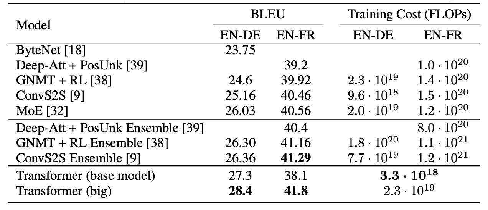

# 自然言語AI:Tensorflowを利用したTransformerモデルの作成の実践

本日は、第四回岡山メディカルAI・ICT研究会ご参加ありがとうございます。  
このレクチャーでは、2017/12/6に Googleより発表された"Attention Is All You Need"の論文に示された内容を自PCで再現させるデモンストレーションを行います。
具体的には、ポルトガル語→英語の自動翻訳機を作成してみます。

PCとPython,Jupyter環境により動作させることができます。
ソースファイルは、Githubに登録しておりますから、後日、ご自身でも体験していただきたく思います。

<https://github.com/machinelearning-takafamily/tensorflow-translation>

## 自己紹介

高橋 康 Yasushi Takahashi

日本電気株式会社　医療ソリューション事業部

担当業務：医療業務アプリケーションの設計・開発

## 動作させる環境について

### PC/OS

Macbook pro 16 / Catalina

>Windowsでもおそらく問題ありません。（未評価）

### IDE

Microsoft Visual Studio Code 1.5.1.1  
<https://azure.microsoft.com/ja-jp/products/visual-studio-code/>

導入プラグイン

* Python 拡張機能  
* Jupyter 拡張機能  
* Remote - SSH 拡張機能

### Jupyter Server

Oracle Cloud GPU Instance

今回は、訓練時間の都合で、データセンタのサーバーを特別に利用しています。  
クライアントだけでも、処理時間はかかりますが動作をさせることは可能です。

CPU : 6  
MEMORY : 90GB  
GPU : NVIDIA Tesla V100  
NVIDIA UNIX x86_64 Kernel Module : 450.80.02
CUDA Version: 10.1

このサーバを利用しても、訓練時間が約１２分かかります。  
そのため、訓練中は、休憩時間とさせていただきます。

### 言語

Python 3.8.3
<https://www.python.org/downloads/>

導入モジュール

* jupyter@1.0.0  
* tensorflow-datasets@4.1.0  
* tensorflow@2.3.1  
* matplotlib@3.3.3  
* pandas@1.1.4  

> ANACONDAでも構いません
> <https://www.anaconda.com/products/individual>

## 本題に入る前に補足知識から

### CNN

* 人間の視覚構造に基づいて設計され、画像認識に広く使用されるニューラルネットワーク
* 畳み込み(Conv)層とプーリング(Pooling)層の繰り返しによって、画像からの特徴抽出を繰り返し、その特徴を使用して分類などのタスクを実行する。
* 畳み込み層では、特徴フィルタが画像上をスライドし、フィルタがかかった部分との重み付け和を計算し、特徴抽出を行う。
* プーリング層では、畳み込み層に対して、一定範囲（通常2*2など）のピクセルの平均値や最大値をとってダウンサンプリングする。

### RNN

* 中間層に再帰構造（出力が自分以前の中間層に戻る構造）を持つニューラルネットワーク
* 入力値と出力値に可変長の時系列データ（文章、音声など）を扱うことができる
* 中間層は状態を持ち、入力と前時刻の状態を与えられると、出力値を計算し状態を更新

### Word Embedding (単語埋め込み)

* 単語をベクトルで表現する技術の一つ  
→ニューラルネットワークなど、機械学習モデルへの入力として使用する
* Word2Vec , GloVe, fastTextなど

### seq2seq

* 主に機械翻訳に用いられる文章変換モデル
* EncoderとDecoderから成り立ち、それぞれRNN構造を持つ  
  * LSTM：RNNの一種
* Encoderでは、入力文の単語を順次与えて特徴抽出を行い、状態ベクトルを更新する
* Decoderでは、Encoderから出力された状態ベクトルと前時点の出力単語を与えて、状態ベクトルを更新。
* Decoderの出力をSoftmax関数にかけ、語彙中の各単語に対して、それが出力単語に該当する可能性を算出
  * Softmax関数：入力されたベクトルに対して、その値の合計値が１になるように正規化する関数
* 一番高い可能性が算出された単語を出力単語とする
* 入力文の全単語の情報が一つの状態ベクトルに凝縮されてしまう課題がある。

### Attention

* seq2seqにおいて、Encoderの全時刻の状態をDecoderで利用する仕組み
* Decoder中間層の現時刻の状態：Query
* Encoder中間層の各時刻における状態：Key, Value
※KeyとValueは同じもの
* QueryとKeyを元に、各時刻のValueにかける重みを計算(図のattention weights)  
→Decoderでの出力単語算出の際に、Encoder側のどの単語に注目すべきかを表すスコア（＝依存関係、関連度）を獲得
* Valueを重み付け和し(図のcontext vector)、Decoder中間層に与える
* Valueの重み付け和とDecoder側の中間層の状態を元に出力単語を算出

## Transformer Abstract

* 従来の主要な文章変換モデルは、EncoderやDecoderを持ち、複雑な再帰構造(RNN)または畳み込み構造(CNN)に基づいたニューラルネットワークである。
* AttentionによってEncoderとDecoderをつないだものが、現状最も良い性能を出す。
* 今回提案するTransformerは再帰構造や畳み込み構造のない、AttentionのみによってEncoderとDecoderを構成するモデルである。
* 従来のモデルに比べ、翻訳タスクにおいて最も高い性能を示し、かつ訓練にかかる時間も圧倒的に少ない
* Transformerは、他のタスクにも適用できる汎用的なモデルである。

## Introduction + Background

* 従来、機械翻訳などの自然言語処理タスクではRNNを用いた手法が最も良いとされていた。
* RNNモデルは入力や出力の文章を先頭から逐次的に処理するため、処理の並列化ができない。
* 計算効率や性能は向上しているが、根本的な解決にはなっていない。
* 直列計算の削減のためにCNNを採用したモデルもある。
* CNNモデルでは入出力文章の離れた位置間の依存関係の訓練にコストがかかる。文章の長さに伴ってコスト増加。
* Attentionは入出力文章間の単語の依存関係を距離に関係なく獲得でき、機械翻訳などでは欠かせないものとなったが、RNNと併せて使用される。
* Self-Attentionは入出力に同じ文章を与えることで、一つの文章内の依存関係を獲得する仕組み。  
※入出力に違う文章が与えられるものはSource-Target Attentionという。
* Transformerでは、RNNもCNNも使用せず、Self-Attentionのみで与えられた文章の特徴表現を導出する初のモデルである。  
* Transformerは処理の並列化を可能とし、計算コストを定数オーダーにまで削減、かつ少ない訓練時間で最高の性能を達成できる。

## Model Architecture

### 全体の構造

* Encoder：左側の灰色のブロック
* Decoder：右側の灰色のブロック
* Encoder・Decoder共に青枠のAttention(Self-Attention)とFeed Forward(全結合ニューラルネットワーク)で与えられた文章の特徴抽出を行う。
  * 従来のseq2seqにおいてRNNが行なっていた処理
  * 文を構成する単語群がまとめて与えられて並列に処理される
    * 推論時のDecoderのみ従来通り逐次処理を行う。 
* 赤枠のAttention(Source-Target Attention)で入力文の情報（特徴表現）をDecoder側に与える。
  * 従来のseq2seq2におけるAttention処理に相当

### 構成要素

#### Scaled Dot-Product Attention

* TransformerにおけるAttentionの基本構造
* Encoder-Decoderに組み込まれていたAttentionを、Encoder-Decoderから切り離して独立して使用。
* Query, Key, Valueのリストを行として並べて、行列Q, K, Vとして計算
* QとKの行列積を計算（図のMatMul）=QueryとKeyの内積を算出(Dot-Product)
* 正規化(Scaled)した上でsoftmax関数にかける→Vにかけられる重み行列を算出
* 重み行列とVの行列積を計算→Attentionの出力行列  
※各行が、該当する行位置のQueryから得られたValueの重み付け和ベクトルに該当

* $d_k$：QueryとKeyの次元数

* Self-Attentionでは、QとK(V)に同じ文章を与え、単一の文章同士で演算を行う  
→当文章内の単語間の依存関係を獲得し、これを加味した特徴表現が出力行列となる。

※memoryはkey-valueに相当。丸の大きさが重みの大きさ

#### Multi-Head Attention

* 小さな（=次元数の少ない）複数のAttention（headと呼ぶ）で並列に処理する
* 各headへの入力の際、Q, K, Vに対して線形変換処理を行い次元圧縮
* 各headの出力を結合して線形変換をかけ、全体の出力とする

* 訓練時はこれらの線形変換の行列（$W^?_?$）を更新し、headにおいてQとK(V)間の依存関係を適切に獲得できるようにする。 
* head毎に独立に訓練させることで、異なる特徴フィルタを獲得  
* 単一のAttentionよりも多様な特徴抽出→依存関係導出が可能になり、性能向上

#### Positional Encoding

* RNN構造排除によって失われる位置情報を補う手法
* 単語埋め込みベクトルに、次元毎に異なる周波数のsin関数、cos関数の値を足す

※pos：文章中の単語の位置番号（＝行列の行番号）、i：単語埋め込みベクトルの次元番号、$d_{model}$：埋め込みベクトルの次元数

|pos|dim4|dim5|dim6|dim7|
|----|----|----|----|----|
|10|1|0|0.5|0.8|
|20|0|-1|0.8|0.3|
|30|-1|0|0.8|-0.3|
|40|0|1|0.5|-0.8|

* 個々の次元を見ると、同じ値になっている posの組がある
  * 例：dim4では、pos=20と40で同じ値0
* dim4 ~ dim7のベクトルで見ると、値が全て同じになるposの組はない  
→各posに一意のベクトルを与えられるので、一意の位置情報を表現するベクトルとして使用できる

#### Masked Multi-Head Attention

* Decoder側のSelf-Attentionにて使用
* 各Queryに関して、文章中で自分より後ろに位置するKeyにかける重みを0にする  
※下図において、黒丸の部分を無視することに相当
* 未来の情報（＝自分より後ろの単語の情報）が伝達されて予測に使用されるのを防ぐ

#### Position-wise Feed Forward

* 通常の全結合ニューラルネットワーク。中間層1層+出力層からなる。
* Attentionの出力行列の各行ベクトル毎に入力されて演算（重みは共有）

#### residual connection

* 構成図の"Add & Norm"のAddの部分
* 層への入力をそのまま層の出力に足し合わせる
  * 訓練時の勾配消失を軽減するため残差接続を行う

#### layer normalization

* 構成図の"Add & Norm"のNormの部分
* 層の出力の正規化

### 処理の流れ

#### Encoder

※以下は図の赤字の番号に対応

1. 入力文の各単語を埋め込みベクトルに変換する  
2. 埋め込みベクトルに、Positional Encodingを加算し位置情報を追加する。
3. 2.の出力を Multi-Head Attention(Self-Attention)に与える  
4. 3.のAttentionの出力と入力を合算し(residual connection)、正規化(layer normalization)
5. 4.の出力をPosition-wise Feed Forwardに与える
6. 5.のNNの出力と入力を合算し、正規化
7. 3.から6.の処理をさらに5回繰り返す(計６回)  
8. 最後の段の6.の出力がDecoder側に渡される

#### Decoder

※以下は図の青字の番号に対応  
※推論時は従来のseq2seqと同じく各時点で１個ずつ出力文の単語を予測

1. 訓練時：出力文の各単語を埋め込みベクトルに変換する  
   推論時：この時点までにDecoderから出力された単語群を埋め込みベクトルに変換する
2. 埋め込みベクトルに、Positional Encodingをかけて位置情報追加
3. 2.の出力を Masked Multi-Head Attention(Self-Attention)に与える  
4. 3.のAttentionの出力と入力を合算し、正規化
5. 4.の出力を Multi-Head Attention(Source-Target Attention)に与える  
6. 5.のAttentionの出力と入力を合算し、正規化
7. 6.の出力をPosition-wise Feed Forwardに与える
8. 7.のAttentionの出力と入力を合算し、正規化
9. 3.から8.の処理をさらに5回繰り返す(計６回)  
10. 最後の段の8.の出力を線形変換＋softmax関数にかけ、単語予測を行う  

## Why Self-Attention

下記の点でRNNやCNNよりも優れている

※n：文章の長さ（＝単語の数）、d：単語埋め込みベクトルの次元数、k：特徴フィルタのサイズ

* Complexity per Layer：各層の計算複雑性
  * n < dである時、RNN, CNNよりも複雑性低い
  * ほとんどのモデルで n < d は成立
* Sequential Operations：直列処理（並列化できない部分）の処理ステップ量
  * RNNはnのオーダー、Self-Attentionは定数オーダー(CNNも)
* Maximum Path Length : 単語同士の関係性獲得に必要な処理ステップ量
  * RNNはnのオーダー、CNNは$log_k(n)$のオーダー、Self-Attentionは定数オーダー
* 各headが文章の構文的または意味論的な構造を捉えることができている(Attention Visualizations参照)

## Attention Visualizations

Encoder側の５段目のSelt-Attention層を可視化

### figure 3

* Query="making"に対して算出された全Headの注目度（＝重み）
* more, difficultに強い注目  
→"making ... more difficult"の句構造を獲得できている

### figure 4

* 上部：Head 5で算出された注目度全て
* 下部：Head 5, 6で算出された、Query="its"に対する注目度  
→its"が"Law"を指すという照応関係、"application"に係るという係り受けを獲得できている

### figure 5

* 上下で、異なる二つのHeadで算出された注目度全てを表示
* 各Headで異なる特徴抽出→依存関係獲得がされていることがわかる

## Training

* base modelとbig modelの２種類のモデルを作成
* 英語ードイツ語翻訳と英語ーフランス語翻訳の２つのタスク用に訓練
* 訓練データ
  * WMT 2014 English-German : 文章ペア450万、37000語の語彙
  * WMT 2014 English-French：文章ペア3600万 、32000語の語彙
* 訓練マシン：NVIDIA P100 ８個
* 訓練期間
  * base model：12時間（0.4s * 10000step）
  * big model：3.5日（1.0s * 300000step）
* 最適化関数：Adam
  * 学習率は可変。最初期は上げていき、その後下げていく。
* 正則化（＝過学習の回避）
  * Dropout：層からの出力データの値を一定確率で０にすること  
→Encoder, Decoderへの入力や、各層の出力に対して適用
  * Label Smoothing：訓練時の正解ラベル(one-hotベクトル）にノイズを注入

## Results  

### スコアと学習コストの比較

* BLEU：機械翻訳の評価方法。予め用意した複数の正解訳との一致度を計算
* FLOPS：訓練に費やされた計算量  
* 従来よりも小さなFLOPSで高いBLEUを獲得

### ハイパーパラメーターによる性能変化

* $N$：EncoderとDecoderにおけるAttention+FeedForwordの繰り返し数
* $d_{model}$ : 単語埋め込みベクトルの次元
* $d_{ff}$ : FeedForwadの中間層の次元
* $h$ : Multi Head AttentionのHead数
* $d_k, d_v$：Headへの入力ベクトルの次元
* $P_{drop}$ : Dropoutの適用確率
* $\epsilon_{ls}$：Label Smoothingで当てるノイズの大きさ
* PPL：perplexity。単語を特定する際の選択の幅を表す指標で、小さいほど良い
* 空白部分はbaseと同じ値

### 英語の構文解析への適用結果 

* Transformerを4層重ねたモデルで訓練
* 構文解析に特化したモデルでないにも関わらずトップクラスの性能を記録
* Transformerは機械翻訳以外のタスクにも応用できる汎用性を持つ
  
## Conclusion

* TransformerはAttentionだけで構成された最初の文書変換モデルで、RNN構造をMulti-head self attentionに置き換えた。
* RNNやCNNに基づくモデルよりも訓練が早く、WMTの翻訳タスクでSOTAを達成
* 今後は画像、音声、動画を扱うタスクなどにも応用する予定
